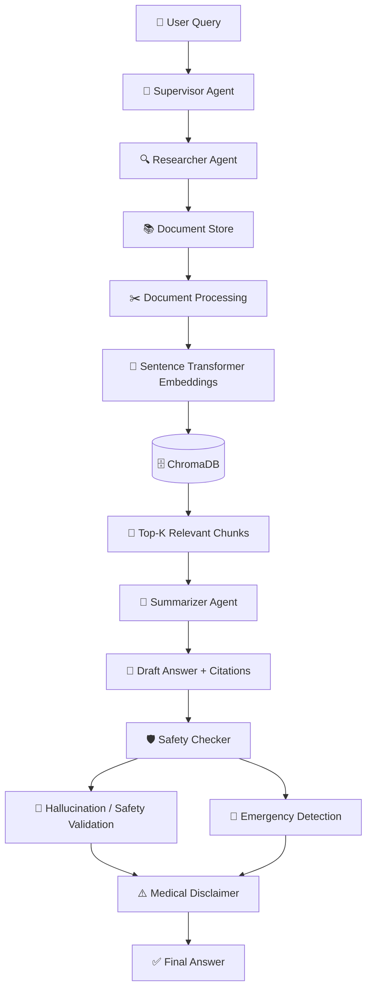
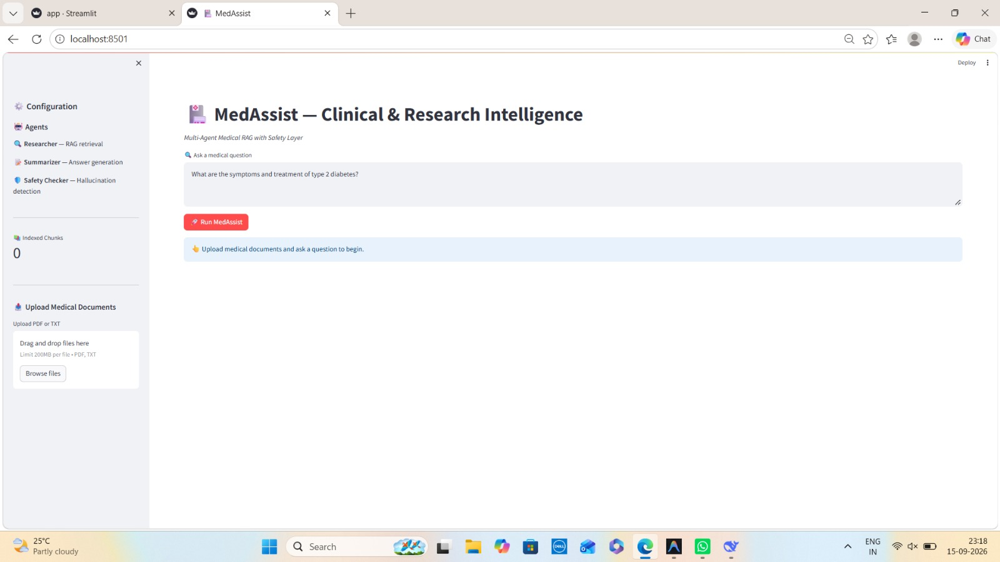

<p align="center">
  
  
  
  
  
  
  
</p>

<h1 align="center">🏥 MedAssist</h1>

<h3 align="center">
Multi-Agent Clinical & Research Intelligence System
</h3>

<p align="center">
  <b>Advanced RAG + Multi-Agent Orchestration + Safety Guardrails</b>
</p>

<p align="center">
  An AI-powered medical research assistant designed to retrieve information from
  medical documents, generate cited responses, and apply safety validation before
  presenting the final answer.
</p>

<p align="center">
  <i>Researcher → Summarizer → Safety Checker — Accurate, Cited & Safety-Aware Medical AI</i> 🚀
</p>

---

## 📌 Overview

**MedAssist** is a multi-agent medical intelligence system that combines **Retrieval-Augmented Generation (RAG)** with specialized AI agents and safety-oriented validation.

Instead of directly asking an LLM to answer a medical question, MedAssist follows a structured workflow:

```text
User Query
    ↓
Supervisor Agent
    ↓
Researcher Agent
    ↓
Semantic Retrieval
    ↓
Medical Document Chunks
    ↓
Summarizer Agent
    ↓
Draft Answer + Citations
    ↓
Safety Checker
    ↓
Safety / Hallucination Validation
    ↓
Final Response + Disclaimer
```

The system is designed around the idea that medical AI should **retrieve relevant information first, generate a grounded answer, and validate the response before showing it to the user.**

---

## 🎯 Why MedAssist?

Traditional LLM applications can generate answers directly from model knowledge. For medical and research-oriented use cases, this can introduce problems such as:

* Hallucinated information
* Unsupported claims
* Missing source references
* Lack of document grounding
* Unsafe responses to emergency-related queries

MedAssist addresses these challenges by combining:

| Problem               | MedAssist Approach                |
| --------------------- | --------------------------------- |
| Hallucination         | Safety Checker + grounding        |
| No sources            | Source citations                  |
| Generic LLM knowledge | RAG from uploaded documents       |
| Complex workflow      | Multi-Agent orchestration         |
| Medical safety        | Safety validation + disclaimer    |
| Emergency queries     | Emergency keyword detection       |
| Large documents       | Semantic chunking + vector search |

---

# 🏗️ System Architecture



---

# 🤖 Multi-Agent Architecture

MedAssist divides the workflow into specialized agents instead of making a single LLM perform every task.

| Agent                  | Role          | Responsibility                            |
| ---------------------- | ------------- | ----------------------------------------- |
| 🧠 **Supervisor**      | Orchestration | Coordinates the complete workflow         |
| 🔍 **Researcher**      | Retrieval     | Searches relevant medical information     |
| 📝 **Summarizer**      | Generation    | Creates structured answers with citations |
| 🛡️ **Safety Checker** | Validation    | Performs safety and hallucination checks  |

### Why multiple agents?

Each agent has a **specific responsibility**.

This makes the system easier to:

* Debug
* Extend
* Evaluate
* Monitor
* Improve independently

---

# 📚 Advanced RAG Pipeline

The RAG pipeline allows MedAssist to answer questions using information from uploaded medical documents.

```text
PDF / TXT
   ↓
Document Processing
   ↓
Text Extraction
   ↓
Semantic Chunking
   ↓
Embeddings
   ↓
ChromaDB
   ↓
Similarity Search
   ↓
Top-K Relevant Chunks
   ↓
LLM
   ↓
Grounded Answer
```

### 🔢 Embeddings

MedAssist uses **Sentence Transformers** to convert text into numerical vector representations.

Conceptually:

```text
Medical Text
     ↓
Embedding Model
     ↓
[0.21, -0.44, 0.72, ...]
```

Similar medical concepts produce vectors that are closer in semantic space.

---

# 🗄️ ChromaDB

**ChromaDB** is used as the vector database.

It stores:

* Document chunks
* Embeddings
* Metadata

During a query, MedAssist performs semantic similarity search to retrieve relevant chunks.

```text
User Question
      ↓
Question Embedding
      ↓
ChromaDB Similarity Search
      ↓
Top-K Relevant Chunks
```

This allows the LLM to work with retrieved context rather than relying only on its general model knowledge.

---

# 🛡️ Safety Layer

Safety is a core part of the MedAssist architecture.

The system includes:

### 🔎 Hallucination Detection

The generated answer is checked against the retrieved information.

The goal is to identify unsupported or potentially hallucinated information.

### 🚨 Emergency Detection

The system can detect emergency-related keywords such as:

```text
Chest Pain
Suicide
Overdose
Emergency Symptoms
```

This allows the application to provide appropriate safety-oriented messaging instead of treating every query like a normal research question.

### ⚠️ Medical Disclaimer

Responses include a disclaimer reminding users that the system is intended for educational/research purposes and is not a replacement for professional medical care.

---

# 📖 Citation-Based Answers

One of the important features of MedAssist is source-aware answer generation.

Example:

```text
Type 2 diabetes can cause increased thirst, frequent urination,
fatigue and blurred vision [1][2].

Treatment may involve lifestyle changes and medications [2][3].
```

The goal is to make generated information easier to trace back to the retrieved document context.

---

# 📊 Confidence Scoring

MedAssist can provide a confidence-oriented score based on factors such as:

```text
Retrieval Relevance
        +
Answer Faithfulness
        ↓
Confidence Score
```

Example:

```text
Confidence: 82%
```

This score should be treated as a system-level signal, **not as a medical certainty or clinical probability.**

---

# ✨ Key Features

| Feature                    | Description                                            |
| -------------------------- | ------------------------------------------------------ |
| 📚 **Advanced RAG**        | Retrieves relevant information from medical documents  |
| 🤖 **Multi-Agent System**  | Specialized agents for research, generation and safety |
| 🔍 **Semantic Search**     | ChromaDB + Sentence Transformers                       |
| 📖 **Source Citations**    | Supports source-aware responses                        |
| 🛡️ **Safety Validation**  | Safety and hallucination-oriented checks               |
| 🚨 **Emergency Detection** | Detects selected emergency-related keywords            |
| 📊 **Confidence Signal**   | Relevance + faithfulness-oriented scoring              |
| 📄 **PDF Support**         | Process medical PDF documents                          |
| 📝 **TXT Support**         | Process text-based medical documents                   |
| 🖥️ **Interactive UI**     | Streamlit dashboard                                    |
| ⚡ **Fast Retrieval**       | Vector similarity search for relevant chunks           |

---

# 🧰 Tech Stack

| Layer         | Technology                      | Purpose                |
| ------------- | ------------------------------- | ---------------------- |
| 🐍 Language   | Python 3.11+                    | Core development       |
| 🧠 LLM        | Groq / `groq/compound-mini`     | Reasoning + generation |
| 🔗 RAG        | LangChain                       | Retrieval pipeline     |
| 🤖 Agents     | Custom Multi-Agent Architecture | Workflow orchestration |
| 🔢 Embeddings | Sentence Transformers           | Text embeddings        |
| 🗄️ Vector DB | ChromaDB                        | Semantic search        |
| 📄 PDF Parser | pdfplumber                      | PDF text extraction    |
| 🖥️ UI        | Streamlit                       | Interactive dashboard  |

---

# 📸 Application Screenshots

## 🖥️ MedAssist Dashboard

<p align="center">
  
</p>

<p align="center">
  <i>MedAssist dashboard for document ingestion, medical research queries and safety-aware responses.</i>
</p>

> 📌 **Screenshot path:** `images/dashboard.jpeg`

---

# 🚀 Getting Started

## Prerequisites

Make sure you have:

* Python `3.11+`
* Anaconda / Miniconda
* Git
* Groq API Key

---

## 1️⃣ Clone the Repository

```bash
git clone https://github.com/vaibhav07772/medassist.git
cd medassist
```

---

## 2️⃣ Create Conda Environment

```bash
conda create -n medassist python=3.11 -y
conda activate medassist
```

---

## 3️⃣ Install Dependencies

```bash
pip install -r requirements.txt
```

---

## 4️⃣ Configure API Key

Create a `.env` file in the project root:

```env
GROQ_API_KEY=your_groq_api_key_here
```

### 🔐 Important

Never commit your real API key to GitHub.

Make sure `.env` is included in `.gitignore`.

---

## 5️⃣ Run MedAssist

```bash
streamlit run src/app.py
```

Then open the Streamlit URL shown in your terminal.

---

# 📄 How to Use

### Step 1 — Upload Documents

Upload medical:

* Research papers
* Clinical guidelines
* PDF documents
* TXT documents

### Step 2 — Index Documents

The documents are processed and converted into searchable vector representations.

### Step 3 — Ask a Question

Example:

```text
What are the symptoms and treatment of type 2 diabetes?
```

### Step 4 — Retrieval

The Researcher Agent searches ChromaDB for relevant document chunks.

### Step 5 — Generation

The Summarizer Agent uses the retrieved context to create a structured response.

### Step 6 — Safety Validation

The Safety Checker validates the generated response and checks for safety-related conditions.

### Step 7 — Final Answer

The user receives the final response along with available citations and the medical disclaimer.

---

# 📂 Project Structure

```text
medassist/
│
├── src/
│   │
│   ├── ingestion/
│   │   ├── document_processor.py
│   │   └── vector_store.py
│   │
│   ├── agents/
│   │   ├── researcher.py
│   │   ├── summarizer.py
│   │   ├── safety_checker.py
│   │   └── supervisor.py
│   │
│   ├── safety/
│   │   ├── hallucination.py
│   │   └── guardrails.py
│   │
│   ├── reports/
│   │   └── report_analyzer.py
│   │
│   └── app.py
│
├── data/
│   ├── documents/
│   └── chroma_db/
│
├── images/
│   └── dashboard.png
│
├── requirements.txt
├── .env.example
├── .gitignore
└── README.md
```

---

# 🔬 Example Workflow

### User Query

```text
What are the symptoms and treatment of type 2 diabetes?
```

### Researcher Agent

```text
Search ChromaDB
       ↓
Retrieve relevant medical chunks
```

### Summarizer Agent

```text
Retrieved Context
       +
User Question
       ↓
Structured Answer
       +
Citations
```

### Safety Checker

```text
Draft Answer
     ↓
Safety Validation
     ↓
Hallucination / Emergency Checks
```

### Final Response

```text
Answer
+
Citations
+
Confidence Signal
+
Medical Disclaimer
```

---

# 🏢 Potential Real-World Applications

| Industry               | Potential Application        |
| ---------------------- | ---------------------------- |
| 🏥 Hospitals           | Clinical information support |
| 🔬 Medical Research    | Literature review assistance |
| 💻 Telemedicine        | Pre-consultation information |
| 💊 Pharma              | Research assistance          |
| 🎓 Medical Education   | Student learning support     |
| 🚀 Healthcare Startups | Medical information systems  |

> These are potential applications. MedAssist should not be treated as an autonomous clinical decision-maker.

---

# 🔮 Future Improvements

The architecture can be extended with:

* 🔎 **PubMed Integration** — Retrieve research literature automatically
* 🧪 **Lab Report Analysis** — Support image-based reports
* 🧠 **Domain-Specific Fine-Tuning** — Medical-domain model adaptation
* 🌍 **Multi-Language Support** — Hindi, Spanish and other languages
* 👨‍⚕️ **Doctor Review Mode** — Human-in-the-loop validation
* 🐳 **Docker Deployment** — Containerized deployment
* ⚡ **FastAPI Backend** — Separate frontend/backend architecture
* 📊 **Evaluation Pipeline** — RAG quality and hallucination benchmarks
* 🔐 **Authentication & Access Control** — Secure multi-user deployment
* 📈 **Observability** — Production monitoring and evaluation

---

# 🎤 Interview Explanation

### Short Answer

> **"MedAssist is a multi-agent medical intelligence system that combines RAG, semantic search and safety guardrails. The Researcher Agent retrieves relevant information from medical documents using ChromaDB and embeddings. The Summarizer Agent generates a structured answer with citations, while the Safety Checker validates the response for safety and hallucination-related issues before returning the final answer."**

### 30-Second Version

> **"I built MedAssist to explore how LLM applications can be made more reliable for medical research use cases. Instead of directly asking an LLM to answer a query, I designed a multi-agent workflow. A Supervisor coordinates the Researcher, Summarizer and Safety Checker agents. The Researcher retrieves relevant document chunks using Sentence Transformers and ChromaDB, the Summarizer generates a cited answer from that context, and the Safety Checker performs safety and hallucination-oriented validation. The application is exposed through a Streamlit dashboard and uses Groq for LLM inference."**

---

# 🧠 Key AI Engineering Concepts Demonstrated

This project demonstrates practical understanding of:

```text
RAG
│
├── Document Ingestion
├── Text Chunking
├── Embeddings
├── Vector Database
├── Semantic Search
└── Context-Grounded Generation

Multi-Agent AI
│
├── Supervisor
├── Researcher
├── Summarizer
└── Safety Checker

AI Safety
│
├── Guardrails
├── Hallucination Checks
├── Emergency Detection
└── Disclaimers
```

---

# ⚠️ Limitations & Safety

MedAssist is an **educational and research project**.

It should **not** be used as a substitute for:

* Medical diagnosis
* Professional medical advice
* Emergency medical services
* Treatment decisions
* Clinical decision-making

The confidence score generated by the system is an application-level signal and **does not represent medical certainty**.

For real clinical deployment, the system would require extensive validation, expert review, privacy/security controls, monitoring, and appropriate regulatory compliance.

---

# 🤝 Contributing

Contributions are welcome.

```text
Fork
 ↓
Create Feature Branch
 ↓
Make Changes
 ↓
Commit
 ↓
Open Pull Request
```

For major changes, please open an issue first to discuss the proposed modification.

---

# 📜 License

This project is released under the **MIT License**.

---

# 📬 Connect With Me

### Vaibhav Singh

<p>
  <a href="https://github.com/vaibhav07772">
    
  </a>
  <a href="https://www.linkedin.com/in/vaibhav07772/">
    
  </a>
</p>

📧 **Email:** `vs9502778@gmail.com`

---

# ⭐ Show Your Support

If you find **MedAssist** useful or interesting, consider giving the repository a ⭐ on GitHub.

<p align="center">
  <b>Researcher → Summarizer → Safety Checker</b>
  <br/>
  <i>Building safer and more grounded LLM applications 🚀</i>
</p>
